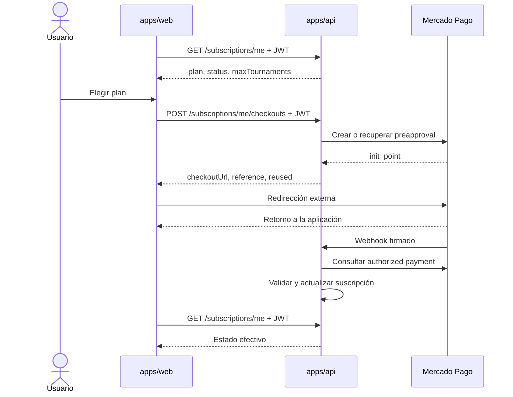

# Integración frontend con Mercado Pago

Esta guía define cómo integrar en `apps/web` el flujo de suscripciones recurrentes que el backend ya expone. Está orientada al equipo frontend: explica responsabilidades, contratos, estados de interfaz, errores y criterios de prueba.

> **Regla principal:** el retorno del navegador desde Mercado Pago no confirma el pago. La única fuente de verdad para la interfaz es `GET /subscriptions/me`; el backend actualiza ese estado después de validar los webhooks y consultar el cobro canónico en Mercado Pago.

## 1. Alcance y límites

El frontend debe:

- mostrar el plan y estado efectivos;
- solicitar al backend la creación o reutilización de un checkout;
- redirigir al usuario a la URL recibida;
- recuperar el estado al volver de Mercado Pago;
- solicitar la cancelación y volver a consultar el estado;
- traducir códigos de error estables a mensajes útiles.

El frontend **no debe**:

- llamar directamente a la API de Mercado Pago;
- conocer ni exponer `MERCADO_PAGO_ACCESS_TOKEN` o el secreto de webhooks;
- construir precios, moneda, referencias o identificadores del proveedor;
- llamar al webhook;
- activar un plan por parámetros de URL, por `reused` o por haber regresado del checkout;
- confiar en estado local para autorizar funcionalidades de pago.

El backend conserva las decisiones sensibles: identidad, club, precios, moneda, idempotencia, correlación del pago, activación, renovación y cancelación.

## 2. Flujo de extremo a extremo



El retorno y el webhook pueden llegar en cualquier orden. Por eso la página de retorno debe tolerar que el plan todavía figure como `free` o `pending`, informar que se está verificando el pago y permitir actualizar el estado.

## 3. Contrato que consume el frontend

El contrato autoritativo es [`apps/api/openapi.json`](../../../apps/api/openapi.json). No se deben duplicar reglas de negocio que no aparezcan allí o en el backend.

### Consultar la suscripción

`GET /subscriptions/me`

```ts
type Subscription = {
  plan: "free" | "basic" | "pro";
  status: "pending" | "active" | "past_due" | "canceled";
  maxTournaments: number;
};
```

### Crear o reutilizar un checkout

`POST /subscriptions/me/checkouts`

```ts
type CreateCheckoutInput = {
  plan: "basic" | "pro";
};

type Checkout = {
  plan: "free" | "basic" | "pro";
  reference: string;
  checkoutUrl: string;
  reused: boolean;
};
```

`reused: true` significa que el backend reutilizó un checkout pendiente. No significa que el pago fue aprobado.

### Cancelar la suscripción

`POST /subscriptions/me/cancel`

La operación exitosa devuelve `200`. Después de cancelarla, la UI debe volver a consultar `GET /subscriptions/me` en lugar de fabricar un estado local.

Todos los endpoints requieren el JWT del usuario autenticado y un club administrado por esa cuenta.

## 4. Arquitectura recomendada en `apps/web`

Mantener la integración separada por responsabilidad:

```text
src/
├── app/(club)/dashboard/suscripcion/
│   ├── actions.ts                    # Mutaciones server-side
│   ├── page.tsx                      # Estado efectivo y selección de plan
│   ├── loading.tsx                   # Estado de carga de la ruta
│   ├── error.tsx                     # Recuperación ante errores inesperados
│   ├── error-copy.ts                 # Códigos de API → mensajes seguros
│   ├── _components/
│   │   ├── CheckoutForm.tsx          # Formulario y pending state
│   │   └── CancelSubscriptionForm.tsx
│   └── retorno/
│       └── page.tsx                  # Recuperación posterior al checkout
└── services/subscriptions/
    ├── contracts.ts                  # Tipos derivados del OpenAPI
    ├── get-subscription.ts           # GET /subscriptions/me
    ├── create-checkout.ts            # POST /subscriptions/me/checkouts
    └── cancel-subscription.ts        # POST /subscriptions/me/cancel
```

Esta estructura sigue los patrones existentes:

- [`src/services/api/client.ts`](../src/services/api/client.ts) centraliza HTTP, timeout y errores, y está marcado como `server-only`;
- [`src/lib/session.ts`](../src/lib/session.ts) lee el JWT desde la cookie `httpOnly`;
- las Server Actions coordinan formularios y mutaciones sin enviar el token al navegador;
- las páginas y componentes se ocupan de presentación, accesibilidad y estados transitorios.

Los nombres anteriores son una propuesta de implementación, no archivos existentes. No conviene agregar una Route Handler intermedia si la Server Action ya puede llamar de forma segura a `apps/api`.

## 5. Carga inicial

La página de suscripción debe ser un Server Component que:

1. obtiene el token con `getSessionToken()`;
2. redirige a login si no existe una sesión válida;
3. llama a un servicio `server-only` para ejecutar `GET /subscriptions/me`;
4. renderiza el plan, el estado y la cuota efectiva recibidos.

La lectura privada debe usar `cache: "no-store"` para no reutilizar el estado de otra navegación ni mostrar una suscripción desactualizada después de un webhook o una cancelación.

No usar el JSON estático de planes como fuente del estado contratado. Puede seguir sirviendo para contenido comercial, pero `plan`, `status` y `maxTournaments` deben venir del backend.

`maxTournaments` representa el máximo de llaves simultáneas activas. No debe presentarse como “torneos creados por mes”.

## 6. Inicio del checkout

Implementar el cambio de plan con un `<form>` y una Server Action:

1. validar en el servidor que `plan` sea `basic` o `pro`;
2. recuperar el JWT desde la cookie `httpOnly`;
3. llamar a `POST /subscriptions/me/checkouts`;
4. verificar la URL devuelta;
5. redirigir con `redirect(checkoutUrl)`.

```ts
"use server";

import { redirect } from "next/navigation";

export async function startCheckout(
  _previousState: CheckoutActionState,
  formData: FormData,
): Promise<CheckoutActionState> {
  let checkoutUrl: string;

  try {
    const plan = parsePaidPlan(formData.get("plan"));
    const checkout = await createCheckout(plan);
    checkoutUrl = assertAllowedCheckoutUrl(checkout.checkoutUrl);
  } catch (error) {
    return toCheckoutActionState(error);
  }

  redirect(checkoutUrl);
}
```

`redirect()` lanza internamente una excepción de control, por lo que debe ejecutarse **fuera** del `try/catch`. Next.js admite URLs absolutas y, desde una Server Action, responde con una redirección `303`.

### Validación defensiva de la URL

Aunque la URL proviene del backend, validar como defensa en profundidad:

- protocolo `https:`;
- host incluido en una allowlist centralizada de dominios de checkout de Mercado Pago usados por los entornos del proyecto;
- rechazo seguro si la URL no puede parsearse.

No mantener la allowlist dispersa en componentes ni aceptar cualquier URL recibida. Tampoco abrir el checkout en un popup: una navegación completa funciona mejor con bloqueadores, accesibilidad y dispositivos móviles.

### Estado pendiente del formulario

Usar `useActionState` o `useFormStatus` para:

- deshabilitar el botón mientras se procesa;
- mostrar “Preparando checkout…”;
- anunciar errores con `aria-live="polite"`;
- evitar dobles clics accidentales.

El bloqueo visual mejora la experiencia, pero la garantía real contra duplicados pertenece al backend. No generar claves de idempotencia ni referencias en el navegador.

## 7. Página de retorno

Configurar el backend para que `MERCADO_PAGO_BACK_URL` apunte a una ruta dedicada, por ejemplo:

```text
/dashboard/suscripcion/retorno
```

Al cargarla:

1. ignorar cualquier parámetro que pretenda declarar el pago como aprobado;
2. consultar `GET /subscriptions/me` con la sesión actual;
3. si el plan pago está `active`, mostrar confirmación;
4. si todavía no está activo, mostrar “Estamos verificando tu pago”;
5. ofrecer “Actualizar estado” y “Volver a suscripción”.

Si se implementa polling, debe ser acotado: por ejemplo, cada 2–3 segundos durante un máximo de 30–60 segundos, detenido al ocultar la pestaña y cancelado al desmontar el componente. Al terminar el plazo, mantener un botón de actualización manual. No dejar un polling infinito.

No es necesario que el navegador permanezca abierto para que el backend procese el webhook.

## 8. Estados de interfaz

Renderizar explícitamente cada combinación relevante:

| Plan/estado | Tratamiento recomendado |
| --- | --- |
| `free` + `active` | Mostrar plan gratuito y permitir elegir `basic` o `pro`. |
| `basic/pro` + `pending` | Informar que la suscripción está pendiente; no prometer beneficios activos. |
| `basic/pro` + `active` | Mostrar plan vigente, cuota efectiva y acción de cancelación. |
| `basic/pro` + `past_due` | Mostrar alerta de cobro pendiente y bloquear cambios incompatibles. |
| `free` + `canceled` | Informar la cancelación y permitir iniciar un checkout nuevo. |

No derivar permisos desde el nombre del plan. Para anticipar límites puede mostrarse `maxTournaments`, pero la autorización final siempre ocurre en el backend.

## 9. Mapeo de errores

`ApiError.body.code` es el dato estable para decidir la experiencia. No mostrar directamente `message`, stack traces ni detalles del proveedor.

| Código | UX recomendada |
| --- | --- |
| `validation` | “El plan seleccionado no es válido.” |
| `unauthenticated` | Limpiar la sesión inválida y redirigir a login. |
| `club_required` | Llevar al flujo de creación/configuración del club. |
| `checkout_pending_for_another_plan` | Informar que ya existe un checkout pendiente para otro plan. |
| `checkout_in_progress` | Mantener el formulario bloqueado brevemente y permitir reintentar. |
| `active_subscription_must_be_cancelled` | Solicitar cancelar primero la suscripción vigente. |
| `billing_checkout_recovery_required` | Informar que se está verificando una operación anterior; no crear intentos repetidos. |
| `billing_provider_rejected` | Indicar que Mercado Pago rechazó la operación y permitir reintentar más tarde. |
| `billing_provider_unavailable` | Mostrar indisponibilidad temporal y conservar el estado actual. |
| `billing_not_configured` | Mostrar un error operativo y ofrecer contacto con soporte; no sugerir que el usuario lo resuelva. |
| desconocido | Mensaje genérico, identificador de seguimiento y logging sin datos sensibles. |

Un `503` no siempre significa lo mismo: la UI debe distinguir `billing_checkout_recovery_required`, `billing_provider_unavailable` y `billing_not_configured` por su código.

## 10. Cancelación

La cancelación debe usar un formulario separado con confirmación clara. La acción server-side:

1. recupera la sesión;
2. ejecuta `POST /subscriptions/me/cancel`;
3. actualiza o revalida la vista;
4. vuelve a obtener la suscripción efectiva.

No aplicar una baja optimista. La implementación actual cancela el mandato y devuelve la cuenta al plan gratuito; el backend también impide que un cobro tardío reactive una suscripción cancelada.

La confirmación debe explicar el efecto real sobre la cuota, sin afirmar que los torneos existentes serán eliminados: el límite bloquea nuevas creaciones, no borra datos ya creados.

## 11. Seguridad y privacidad

- Mantener `API_BASE_URL` como variable server-side; no crear una copia `NEXT_PUBLIC_*` para este flujo.
- Enviar `Authorization: Bearer <token>` únicamente desde servicios `server-only`.
- No persistir el JWT, `checkoutUrl`, `reference` ni IDs de Mercado Pago en `localStorage`.
- No registrar tokens, URLs completas con parámetros, firmas o payloads sensibles en analytics.
- Validar el plan nuevamente en la Server Action; una UI deshabilitada no es una frontera de seguridad.
- Mantener CSP y navegación externa compatibles con los dominios exactos utilizados por Mercado Pago.
- Tratar el `checkoutUrl` como un dato sensible de corta vida y no compartirlo entre usuarios.

## 12. Accesibilidad y experiencia

- Usar formularios y botones semánticos, no `div` con handlers.
- Conservar foco visible y devolverlo al control que originó un error.
- Anunciar estados pendientes y errores mediante una región `aria-live`.
- No depender solo del color para `pending`, `past_due` o `canceled`.
- Avisar antes de abandonar el sitio hacia Mercado Pago.
- Mantener textos de acción específicos: “Suscribirme al plan Basic” es mejor que “Continuar”.
- Evitar animaciones o timers que oculten información esencial.

## 13. Observabilidad

Registrar eventos de producto sin datos de pago:

- intento de checkout por plan;
- checkout creado o reutilizado (`reused`);
- redirección iniciada;
- retorno recibido;
- estado efectivo observado después del retorno;
- cancelación solicitada y resultado.

Los logs deben incluir códigos internos de correlación cuando existan, pero nunca el access token, la firma del webhook ni información de tarjeta. El frontend no debe enviar un evento “pago aprobado” basándose únicamente en la página de retorno.

## 14. Estrategia de pruebas

### Casos funcionales mínimos

1. usuario sin sesión;
2. usuario autenticado sin club;
3. consulta de plan `free`;
4. checkout nuevo para `basic` y `pro`;
5. reutilización de checkout pendiente;
6. doble envío del formulario;
7. checkout pendiente para otro plan;
8. retorno antes de que se procese el webhook;
9. activación después del webhook;
10. estados `past_due` y `canceled`;
11. cancelación exitosa y fallida;
12. URL de checkout inválida o no permitida;
13. cada código de error de la tabla anterior;
14. navegación por teclado y anuncios de lectores de pantalla.

### Entorno de Mercado Pago

- usar credenciales y cuentas de prueba, nunca datos reales;
- el correo del comprador de prueba debe coincidir con el correo del usuario autenticado en Dupla, porque el backend verifica esa identidad;
- probar comprador y vendedor con cuentas separadas;
- comprobar el resultado final con `GET /subscriptions/me`, no con la pantalla mostrada por Mercado Pago;
- validar casos de webhook demorado, repetido y fuera de orden.

### Gates del paquete

```bash
pnpm --filter web lint
pnpm --filter web build
```

El paquete todavía no declara un runner de tests. Al incorporarlo, priorizar pruebas de servicios, mapeo de errores, estados de las Server Actions y la pantalla de retorno; los flujos reales del proveedor deben probarse en un entorno controlado.

## 15. Orden recomendado de implementación

1. Crear tipos y servicios `server-only` desde OpenAPI.
2. Reemplazar el mock de la pantalla por `GET /subscriptions/me`.
3. Implementar el mapeo centralizado de errores.
4. Implementar checkout con Server Action y estado pendiente.
5. Agregar la página de retorno y recuperación acotada.
6. Implementar cancelación sin estado optimista.
7. Agregar accesibilidad, observabilidad y pruebas.
8. Validar el flujo completo con cuentas de prueba.

## 16. Fuentes y documentación relacionada

### Interna

- [Integración backend completa](../../../docs/mercado-pago-integration.md)
- [Contrato OpenAPI](../../../apps/api/openapi.json)
- [Consumo de API desde el frontend](API.md)
- [Patrón de autenticación frontend](LoginIntegration.md)
- [Arquitectura frontend](Architecture.md)

### Oficial

- [Mercado Pago: crear una suscripción](https://www.mercadopago.com.ar/developers/es/reference/online-payments/subscriptions/create-preapproval/post)
- [Mercado Pago: consultar una suscripción](https://www.mercadopago.com.ar/developers/es/reference/online-payments/subscriptions/get-preapproval/get)
- [Mercado Pago: notificaciones Webhooks](https://www.mercadopago.com.ar/developers/es/docs/wix/additional-content/your-integrations/notifications/webhooks?scope=prod)
- [Next.js: formularios y Server Actions](https://nextjs.org/docs/app/guides/forms)
- [Next.js: `redirect`](https://nextjs.org/docs/app/api-reference/functions/redirect)
