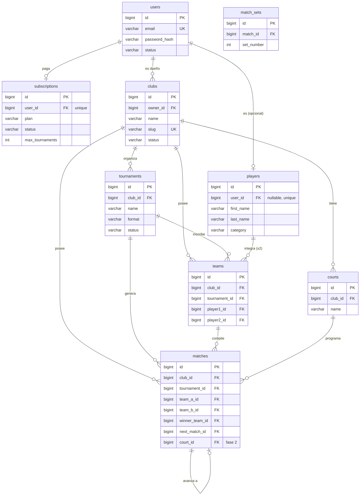

# Modelo de datos — dupla

_ERD de referencia para la fase 1. Las decisiones que lo sustentan están en [decisions.md](./decisions.md) (identidad, tenancy, billing) y el alcance en [product-brief.md](./product-brief.md)._

Este diagrama es la **fuente de documentación** del modelo. La implementación real la owna Prisma (`prisma/schema.prisma`) cuando se genere la migración con el `db-architect`: nombres de modelo, estrategia de `id` (int vs uuid) y enums nativos pueden diferir de lo que se muestra acá.

## Diagrama



## Diccionario de tablas

### Identidad y billing

- **`users`** — identidad de login (email + contraseña). **Sin rol**: "organizador" se deriva de tener un `club`, "jugador" de tener un `player`. Un mismo usuario puede ser ambos.
- **`subscriptions`** — suscripción del usuario dueño (1:1). El plan define cuotas (p. ej. `max_tournaments`). Arranca en `pending` (cobro manual); se activa a mano hasta integrar Mercado Pago.
- **`players`** — perfil global de competidor, **sin `club_id`**. `user_id` nullable: un jugador puede existir sin cuenta (pre-cargado por el organizador) hasta que se registre y reclame el perfil. Es la entidad que habilita historial/ranking cross-club.
- **`clubs`** — el tenant. `owner_id` → usuario dueño. En el MVP hay un club por dueño (el schema soporta varios).

### Torneo

- **`tournaments`** — el torneo, propiedad del club (`club_id`).
- **`teams`** — la dupla inscripta en un torneo (`player1_id` + `player2_id`). **Es la inscripción**; solo dobles en el MVP.
- **`matches`** — partido de la llave. `next_match_id` + `next_slot` modelan el avance automático del bracket. `court_id` / `scheduled_at` son de fase 2.
- **`match_sets`** — resultado por set de un partido.

### Fase 2 (schema desde el día uno)

- **`courts`** — canchas del club, para la programación de partidos (fase 2).

## Notas de diseño

- **`club_id` denormalizado** en todas las tablas de club (`tournaments`, `teams`, `matches`, `courts`) e indexado. Cumple el invariante de tenancy y deja que cada guard filtre por `club_id` directo, sin joins. Es seguro porque el club de una fila nunca cambia.
- **Enums como `varchar`** en el DDL de referencia para que draw.io los importe; en Prisma serán enums nativos.
- **Rol / multi-staff**: cuando exista staff con permisos (owner/admin/planillero), vive en un futuro `club_memberships (user_id, club_id, role)`, no en `users`. Fuera del MVP.

## DDL de referencia

Sirve para regenerar el ERD en draw.io (**`+ (Insert)` → Advanced → SQL…**) y como bosquejo del schema. **No es la migración**: esa la genera Prisma.

```sql
CREATE TABLE users (
  id                BIGSERIAL PRIMARY KEY,
  email             VARCHAR NOT NULL UNIQUE,
  password_hash     VARCHAR NOT NULL,
  email_verified_at TIMESTAMP,
  status            VARCHAR NOT NULL DEFAULT 'active',
  created_at        TIMESTAMP NOT NULL DEFAULT now(),
  updated_at        TIMESTAMP NOT NULL DEFAULT now()
);

CREATE TABLE subscriptions (
  id              BIGSERIAL PRIMARY KEY,
  user_id         BIGINT NOT NULL UNIQUE REFERENCES users(id),
  plan            VARCHAR NOT NULL DEFAULT 'free',     -- free | basic | pro
  status          VARCHAR NOT NULL DEFAULT 'pending',  -- pending | active | cancelled
  max_tournaments INT,
  activated_at    TIMESTAMP,
  created_at      TIMESTAMP NOT NULL DEFAULT now()
);

CREATE TABLE players (
  id         BIGSERIAL PRIMARY KEY,
  user_id    BIGINT UNIQUE REFERENCES users(id),   -- nullable: pre-cargado sin cuenta
  first_name VARCHAR NOT NULL,
  last_name  VARCHAR NOT NULL,
  category   VARCHAR,                               -- enum categoría de pádel
  document   VARCHAR,                               -- para dedup
  phone      VARCHAR,
  city       VARCHAR,
  created_at TIMESTAMP NOT NULL DEFAULT now()
);

CREATE TABLE clubs (
  id         BIGSERIAL PRIMARY KEY,
  owner_id   BIGINT NOT NULL REFERENCES users(id),
  name       VARCHAR NOT NULL,
  slug       VARCHAR NOT NULL UNIQUE,
  status     VARCHAR NOT NULL DEFAULT 'pending',    -- pending | active
  created_at TIMESTAMP NOT NULL DEFAULT now()
);

CREATE TABLE tournaments (
  id         BIGSERIAL PRIMARY KEY,
  club_id    BIGINT NOT NULL REFERENCES clubs(id),
  name       VARCHAR NOT NULL,
  category   VARCHAR,                               -- enum
  format     VARCHAR NOT NULL DEFAULT 'single_elim',
  status     VARCHAR NOT NULL DEFAULT 'draft',      -- draft | open | in_progress | finished
  starts_at  TIMESTAMP,
  created_at TIMESTAMP NOT NULL DEFAULT now()
);

CREATE TABLE courts (
  id         BIGSERIAL PRIMARY KEY,
  club_id    BIGINT NOT NULL REFERENCES clubs(id),
  name       VARCHAR NOT NULL,
  is_active  BOOLEAN NOT NULL DEFAULT true,
  created_at TIMESTAMP NOT NULL DEFAULT now()
);

CREATE TABLE teams (
  id            BIGSERIAL PRIMARY KEY,
  club_id       BIGINT NOT NULL REFERENCES clubs(id),
  tournament_id BIGINT NOT NULL REFERENCES tournaments(id),
  player1_id    BIGINT NOT NULL REFERENCES players(id),
  player2_id    BIGINT NOT NULL REFERENCES players(id),
  seed          INT,
  created_at    TIMESTAMP NOT NULL DEFAULT now()
);

CREATE TABLE matches (
  id             BIGSERIAL PRIMARY KEY,
  club_id        BIGINT NOT NULL REFERENCES clubs(id),
  tournament_id  BIGINT NOT NULL REFERENCES tournaments(id),
  round          INT NOT NULL,
  position       INT NOT NULL,
  team_a_id      BIGINT REFERENCES teams(id),
  team_b_id      BIGINT REFERENCES teams(id),
  winner_team_id BIGINT REFERENCES teams(id),
  next_match_id  BIGINT REFERENCES matches(id),
  next_slot      VARCHAR,                            -- 'A' | 'B'
  court_id       BIGINT REFERENCES courts(id),       -- fase 2
  scheduled_at   TIMESTAMP,                          -- fase 2
  status         VARCHAR NOT NULL DEFAULT 'pending', -- pending | in_progress | finished
  created_at     TIMESTAMP NOT NULL DEFAULT now()
);

CREATE TABLE match_sets (
  id           BIGSERIAL PRIMARY KEY,
  match_id     BIGINT NOT NULL REFERENCES matches(id),
  set_number   INT NOT NULL,
  team_a_games INT NOT NULL,
  team_b_games INT NOT NULL
);
```
