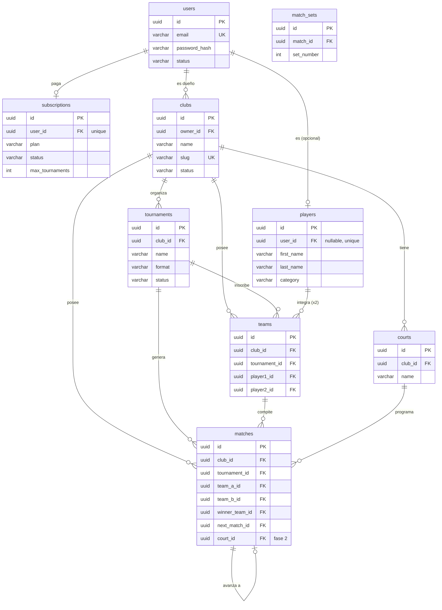

# Modelo de datos — dupla

_ERD de referencia para la fase 1. Las decisiones que lo sustentan están en [decisions.md](./decisions.md) (identidad, tenancy, billing), el alcance en [product-brief.md](./product-brief.md), y la guía operativa de Postgres/Prisma en [database.md](./database.md)._

Este diagrama es la **fuente de documentación** del modelo. La implementación real la owna Prisma (`apps/api/prisma/schema.prisma`); hoy cubre solo `users` (ver "Prisma 7: setup real" en `decisions.md`), el resto de las tablas se migra tabla por tabla con el `db-architect` a medida que cada feature las necesita. Nombres de modelo y enums nativos pueden diferir de lo que se muestra acá; en particular, las columnas de tiempo (`created_at`, etc.) son `timestamptz` en el schema real, no `timestamp`.

## Diagrama

```mermaid
erDiagram
    users {
        uuid id PK
        varchar email UK
        varchar password_hash
        varchar status
    }
    subscriptions {
        uuid id PK
        uuid user_id FK "unique"
        varchar plan
        varchar status
        int max_tournaments
    }
    players {
        uuid id PK
        uuid user_id FK "nullable, unique"
        varchar first_name
        varchar last_name
        varchar category
    }
    clubs {
        uuid id PK
        uuid owner_id FK
        varchar name
        varchar slug UK
        varchar status
    }
    tournaments {
        uuid id PK
        uuid club_id FK
        varchar name
        varchar format
        varchar status
    }
    courts {
        uuid id PK
        uuid club_id FK
        varchar name
    }
    teams {
        uuid id PK
        uuid club_id FK
        uuid tournament_id FK
        uuid player1_id FK
        uuid player2_id FK
    }
    matches {
        uuid id PK
        uuid club_id FK
        uuid tournament_id FK
        uuid team_a_id FK
        uuid team_b_id FK
        uuid winner_team_id FK
        uuid next_match_id FK
        uuid court_id FK "fase 2"
    }
    match_sets {
        uuid id PK
        uuid match_id FK
        int set_number
    }

    users ||--o| subscriptions : paga
    users ||--o| players : "es (opcional)"
    users ||--o{ clubs : "es dueño"
    clubs ||--o{ tournaments : organiza
    clubs ||--o{ courts : tiene
    clubs ||--o{ teams : posee
    clubs ||--o{ matches : posee
    tournaments ||--o{ teams : inscribe
    tournaments ||--o{ matches : genera
    players ||--o{ teams : "integra (x2)"
    teams ||--o{ matches : compite
    courts ||--o{ matches : programa
    matches ||--o| matches : "avanza a"
```

## Diccionario de tablas

### Identidad y billing

- **`users`** — identidad de login (email + contraseña). **Sin rol**: "organizador" se deriva de tener un `club`, "jugador" de tener un `player`. Un mismo usuario puede ser ambos.
- **`subscriptions`** — suscripción del usuario dueño (1:1). El plan define cuotas (p. ej. `max_tournaments`). Arranca en `pending` (cobro manual); se activa a mano hasta integrar Mercado Pago.
- **`players`** — perfil global de competidor, **sin `club_id`**. `user_id` nullable: un jugador puede existir sin cuenta (pre-cargado por el organizador) hasta que se registre y reclame el perfil. Es la entidad que habilita historial/ranking cross-club.
- **`clubs`** — el tenant. `owner_id` → usuario dueño. En el MVP hay un club por dueño (el schema soporta varios).

### Torneo

- **`tournaments`** — el torneo, propiedad del club (`club_id`).
- **`teams`** — la dupla inscripta en un torneo (`player1_id` + `player2_id`). **Es la inscripción**; solo dobles en el MVP.
- **`matches`** — partido de la llave. `next_match_id` + `next_slot` modelan el avance automático del bracket. `court_id` / `scheduled_at` son de fase 2.
- **`match_sets`** — resultado por set de un partido.

### Fase 2 (schema desde el día uno)

- **`courts`** — canchas del club, para la programación de partidos (fase 2).

## Notas de diseño

- **IDs como `UUID` v7.** Claves primarias y foráneas son UUID, no enteros autoincrementales. Se usa **UUIDv7** (time-ordered) para que los inserts caigan casi secuenciales y no fragmenten el índice del PK como haría el v4 aleatorio. Los genera la app vía Prisma (`@default(uuid(7))`), no la base — el Postgres del compose es 17 y `uuidv7()` nativo recién existe en PG 18. Ver [decisions.md](./decisions.md).
- **`club_id` denormalizado** en todas las tablas de club (`tournaments`, `teams`, `matches`, `courts`) e indexado. Cumple el invariante de tenancy y deja que cada guard filtre por `club_id` directo, sin joins. Es seguro porque el club de una fila nunca cambia.
- **Enums como `varchar`** en el DDL de referencia para que draw.io los importe; en Prisma serán enums nativos.
- **Rol / multi-staff**: cuando exista staff con permisos (owner/admin/planillero), vive en un futuro `club_memberships (user_id, club_id, role)`, no en `users`. Fuera del MVP.
