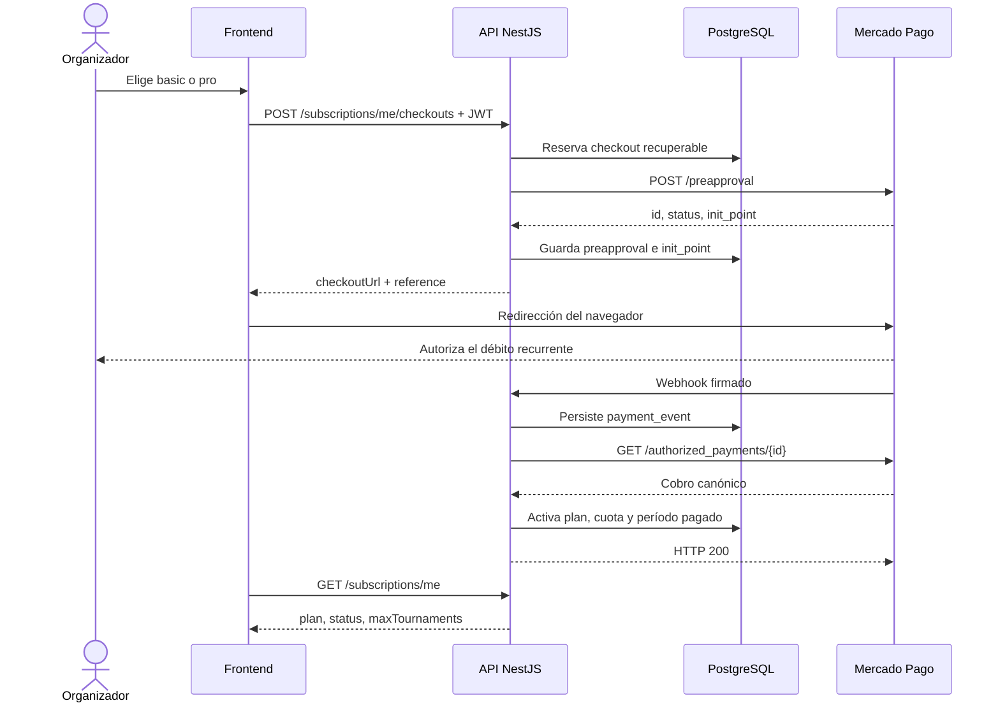
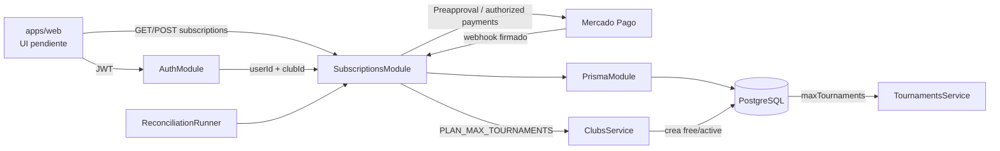

# Integración de Mercado Pago de punta a punta

Esta guía explica el flujo vigente de suscripciones recurrentes de clubes: desde que el frontend solicita un checkout hasta que un cobro confirmado modifica la cuota de torneos. La regla central es simple: **el frontend inicia y redirige; Mercado Pago cobra; el backend verifica y decide; PostgreSQL conserva la verdad durable**.

> Alcance: esta integración cobra la suscripción de la cuenta dueña del club (`basic` o `pro`). No procesa pagos de jugadores a clubes.

## Recorrido rápido

1. El organizador autenticado consulta `GET /subscriptions/me`.
2. El frontend solicita `POST /subscriptions/me/checkouts` con `{"plan":"basic"}` o `{"plan":"pro"}`.
3. El backend fija precio y moneda, reserva un `subscription_checkout` y crea una Preapproval en Mercado Pago.
4. El frontend redirige al `checkoutUrl` devuelto. La URL de retorno solo sirve para volver a la UI; **no confirma el pago**.
5. Mercado Pago llama a `POST /webhooks/mercado-pago?data.id=...`.
6. El backend valida la firma, persiste el evento y consulta el cobro canónico en Mercado Pago.
7. Solo un pago `approved` que coincide con preapproval, referencia, importe y moneda activa el plan en una transacción serializable.
8. Un reconciliador reintenta eventos pendientes y vence derechos cuyo período pagado terminó.



## Límites de confianza

| Entrada               | Qué se acepta como autoridad                                                                                  |
| --------------------- | ------------------------------------------------------------------------------------------------------------- |
| Frontend              | Puede elegir `basic` o `pro`, pero no envía precio, moneda, usuario, club ni estado de pago.                  |
| Retorno del navegador | Solo indica que el usuario volvió desde Mercado Pago. Nunca activa un plan.                                   |
| Webhook               | Dispara el procesamiento únicamente si la firma HMAC es válida. Su payload no acredita por sí solo un cobro.  |
| API de Mercado Pago   | `GET /authorized_payments/{id}` es la lectura canónica del cobro.                                             |
| PostgreSQL            | Conserva checkout, identidad del mandato, eventos, períodos pagados, cancelaciones y locks de reconciliación. |

## 1. Configuración y arranque

La configuración de ejemplo vive en [`.env.example`](../.env.example). El `ConfigModule` global de [`app.module.ts`](../apps/api/src/app.module.ts) carga el `.env` de la raíz y [`subscriptions.module.ts`](../apps/api/src/subscriptions/subscriptions.module.ts) registra controllers, servicios, adaptadores y el reconciliador.

| Variable                                                | Uso                                                                                                                                                                                                |
| ------------------------------------------------------- | -------------------------------------------------------------------------------------------------------------------------------------------------------------------------------------------------- |
| `MERCADO_PAGO_ACCESS_TOKEN`                             | Autoriza creación, consulta, búsqueda y cancelación en la API de Mercado Pago. Sin ella, no hay checkout ni reconciliación.                                                                        |
| `MERCADO_PAGO_BASIC_AMOUNT` / `MERCADO_PAGO_PRO_AMOUNT` | Precios mensuales definidos por servidor, con hasta dos decimales.                                                                                                                                 |
| `MERCADO_PAGO_CURRENCY`                                 | Moneda enviada a Mercado Pago y luego comparada con el cobro canónico.                                                                                                                             |
| `MERCADO_PAGO_BACK_URL`                                 | URL HTTPS a la que vuelve el navegador después del checkout. No es un webhook.                                                                                                                     |
| `MERCADO_PAGO_WEBHOOK_URL`                              | URL HTTPS pública configurada en el panel de Mercado Pago. El backend la exige como condición de habilitación; el cliente HTTP actual no la envía como `notification_url` al crear la Preapproval. |
| `MERCADO_PAGO_WEBHOOK_SECRET`                           | Secreto usado para verificar `x-signature`.                                                                                                                                                        |
| `MERCADO_PAGO_RECONCILIATION_INTERVAL_MS`               | Intervalo opcional del reconciliador; default `60000`, mínimo `10000`.                                                                                                                             |

La URL pública debe apuntar exactamente a `POST /webhooks/mercado-pago`. Para una notificación real, Mercado Pago agrega `data.id` en la query y envía `x-signature` y `x-request-id`.

## 2. Consulta de la suscripción

`GET /subscriptions/me` pasa por `JwtAuthGuard` y `ClubScopeGuard`. El controller obtiene al usuario autenticado y el scope del club; el service busca la suscripción por `userId` y devuelve:

```json
{
  "plan": "free",
  "status": "active",
  "maxTournaments": 1
}
```

El mismo resumen sigue embebido en `GET /clubs/me`. Esto mantiene compatible al frontend existente mientras la pantalla de facturación adopta el recurso específico.

## 3. Creación o reutilización del checkout

`POST /subscriptions/me/checkouts` acepta únicamente:

```json
{ "plan": "basic" }
```

El flujo en `SubscriptionsService.createCheckout` es:

1. Carga la suscripción y el email del dueño.
2. Rechaza un nuevo checkout si la suscripción todavía tiene un mandato activo; primero debe cancelarse.
3. Resuelve precio, moneda y `back_url` desde configuración.
4. Busca un checkout `pending` o `recovery_required`:
   - mismo plan con URL persistida: reutiliza la URL;
   - mismo plan sin resultado comprobable: intenta recuperar por `external_reference`;
   - otro plan: responde `checkout_pending_for_another_plan`.
5. Si no existe, genera una referencia UUID y crea primero una reserva durable en estado `recovery_required`.
6. Llama a `POST https://api.mercadopago.com/preapproval` con email, referencia, precio mensual, moneda, retorno y estado inicial `pending`.
7. Persiste `providerPreapprovalId`, estado del proveedor e `initPoint`, y cambia el checkout local a `pending`.
8. Devuelve `plan`, `reference`, `checkoutUrl` y `reused`.

Crear primero la reserva local evita duplicar mandatos cuando Mercado Pago acepta la solicitud pero la API pierde la respuesta. Ante timeout, error de transporte, JSON inválido o respuesta ambigua, la reserva se conserva y puede recuperarse buscando la referencia opaca. Solo un rechazo con el envelope de validación reconocido se considera definitivo y permite eliminarla.

## 4. Redirección y retorno al frontend

El frontend abre `checkoutUrl`. Cuando el usuario termina o abandona el flujo, Mercado Pago vuelve a `MERCADO_PAGO_BACK_URL`.

La UI debe tratar ese retorno como **estado pendiente**: debe consultar `GET /subscriptions/me` hasta observar el estado efectivo. Ni parámetros del navegador ni una pantalla de “éxito” pueden activar `basic` o `pro`.

En el código actual no hay una pantalla web que consuma el checkout; la integración implementada termina en el contrato HTTP del backend. El frontend debe agregar la selección de plan, la redirección y los estados de espera/error.

## 5. Recepción segura del webhook

`MercadoPagoWebhookController` expone una ruta pública, sin JWT, porque la llama Mercado Pago. El DTO acepta los envelopes documentados de `subscription_authorized_payment` y `subscription_preapproval`, pero el `ValidationPipe` global sigue rechazando campos no declarados.

Antes de escribir, `MercadoPagoHmacWebhookVerifier`:

1. extrae `ts` y `v1` de `x-signature`;
2. exige `x-request-id` y `data.id` en query;
3. verifica que el `data.id` firmado coincida con `payload.data.id`;
4. calcula HMAC-SHA256 sobre `id:<data-id>;request-id:<request-id>;ts:<ts>;`;
5. compara en tiempo constante.

No se descartan reintentos por antigüedad del timestamp: Mercado Pago puede reintentar tarde. La protección contra replay está en la firma y en la idempotencia durable del evento.

## 6. Idempotencia y confirmación canónica

Después de validar la firma, el servicio crea o recupera un `payment_event`. Dos índices únicos impiden aplicar dos veces la misma notificación o el mismo recurso cobrado. Si un mismo ID reaparece con otra identidad (`type`, `action` o `data.id`), responde `webhook_event_identity_conflict`.

Solo `subscription_authorized_payment` inicia la consulta canónica. Otros tipos válidos se archivan y se marcan como procesados sin cambiar la suscripción.

Para un pago autorizado, el backend consulta `GET /authorized_payments/{id}` y aplica estas reglas:

- el ID consultado debe coincidir con el recurso notificado;
- `payment.status` debe ser `approved`;
- en el primer cobro deben coincidir `preapproval_id`, `external_reference`, importe y moneda con el checkout `pending`;
- en renovaciones debe coincidir el `preapproval_id` del mandato activo;
- un evento fuera de orden nunca puede acortar `currentPeriodEndsAt`;
- un cobro no aprobado no concede derechos;
- un rechazo terminal marca la suscripción `past_due`;
- un pago tardío de un mandato cancelado se audita mediante su tombstone, pero no reactiva el plan nuevo.

La actualización del plan se ejecuta con `runSerializable`: mueve juntos `plan`, `status`, `maxTournaments`, `providerPreapprovalId`, `providerStatus` y `currentPeriodEndsAt`; completa el checkout y marca el evento procesado. Si el proveedor no está disponible o todavía falta correlación durable, el evento queda sin `processedAt` y con `lastErrorAt` para reintento.

## 7. Renovación, vencimiento y cancelación

### Renovaciones

Los siguientes cobros llegan por el mismo webhook. Ya no dependen del checkout histórico: la identidad estable es `subscriptions.provider_preapproval_id`.

### Vencimiento

`MercadoPagoReconciliationRunner` se ejecuta al arrancar y luego por intervalo. Usa `billing_job_locks` como lease distribuido para que varias instancias de la API no procesen el mismo lote a la vez. En cada corrida:

1. reintenta hasta 100 eventos autorizados pendientes;
2. degrada a `free/canceled` las suscripciones `active` o `past_due` cuyo `currentPeriodEndsAt` venció;
3. renueva el lease mientras el procesamiento continúa.

No hay período de gracia adicional al período ya pagado.

### Cancelación

`POST /subscriptions/me/cancel` cancela la Preapproval en Mercado Pago. Luego, en una transacción:

1. guarda un `subscription_preapproval_tombstone`;
2. vuelve la suscripción a `free/canceled` y cuota `1`;
3. elimina la identidad activa del mandato y el fin del período.

La tombstone permite reconocer facturas tardías del mandato viejo sin otorgar derechos a una suscripción nueva.

## 8. Cómo se conecta con el resto del sistema



- **Auth:** las rutas del club usan JWT y `ClubScopeGuard`; el webhook es público, pero firmado.
- **Clubs:** al crear el club se crea su suscripción `free/active`. `PLAN_MAX_TOURNAMENTS` define las cuotas `free`, `basic` y `pro` que también usa el webhook.
- **Tournaments:** al crear un torneo, `TournamentsService` lee `maxTournaments` dentro de su propia transacción. Por eso la activación del pago modifica capacidad real sin acoplar torneos a Mercado Pago.
- **Prisma/PostgreSQL:** aportan idempotencia, correlación, transacciones serializables, historial y el lease distribuido.
- **OpenAPI:** `apps/api/openapi.json` publica el contrato para el frontend. Debe regenerarse cuando cambian controllers o DTOs.
- **Frontend:** consume el contrato; nunca recibe secretos ni decide el estado efectivo de la suscripción.

## 9. Mapa de archivos

### Composición, contrato y casos de uso

| Archivo                                                                                          | Responsabilidad                                                                     | Se conecta con                                                  |
| ------------------------------------------------------------------------------------------------ | ----------------------------------------------------------------------------------- | --------------------------------------------------------------- |
| [`app.module.ts`](../apps/api/src/app.module.ts)                                                 | Carga configuración y monta `SubscriptionsModule`.                                  | Config global, Prisma y resto de módulos.                       |
| [`subscriptions.module.ts`](../apps/api/src/subscriptions/subscriptions.module.ts)               | Compone controllers y providers; vincula interfaces con implementaciones HTTP/HMAC. | AuthModule, PrismaModule, runner y adaptadores de Mercado Pago. |
| [`subscriptions.controller.ts`](../apps/api/src/subscriptions/subscriptions.controller.ts)       | Expone consulta, checkout y cancelación autenticados.                               | Guards, decorators, DTOs y `SubscriptionsService`.              |
| [`subscriptions.service.ts`](../apps/api/src/subscriptions/subscriptions.service.ts)             | Orquesta consulta, reserva/recuperación del checkout y cancelación.                 | Prisma, ConfigService y cliente de Preapproval.                 |
| [`create-checkout.dto.ts`](../apps/api/src/subscriptions/dto/create-checkout.dto.ts)             | Restringe el plan solicitado a `basic` o `pro`.                                     | ValidationPipe y controller.                                    |
| [`checkout-response.dto.ts`](../apps/api/src/subscriptions/dto/checkout-response.dto.ts)         | Define la respuesta de checkout.                                                    | Controller, service y OpenAPI.                                  |
| [`subscription-response.dto.ts`](../apps/api/src/subscriptions/dto/subscription-response.dto.ts) | Define plan, estado y cuota efectiva.                                               | Controller, service y OpenAPI.                                  |
| [`openapi.json`](../apps/api/openapi.json)                                                       | Snapshot versionado del contrato que puede consumir el frontend.                    | Controllers y DTOs generados por Swagger.                       |

### Adaptación a Mercado Pago

| Archivo                                                                                                            | Responsabilidad                                                                                                          | Se conecta con                                                                   |
| ------------------------------------------------------------------------------------------------------------------ | ------------------------------------------------------------------------------------------------------------------------ | -------------------------------------------------------------------------------- |
| [`mercado-pago-preapproval.client.ts`](../apps/api/src/subscriptions/mercado-pago-preapproval.client.ts)           | Puerto interno y tipos normalizados; separa dominio de transporte HTTP.                                                  | Services y adaptador HTTP.                                                       |
| [`mercado-pago-http-preapproval.client.ts`](../apps/api/src/subscriptions/mercado-pago-http-preapproval.client.ts) | Implementa create, search, get authorized payment y cancel contra la API externa; clasifica fallos definitivos/ambiguos. | ConfigService, `fetch` y endpoints de Mercado Pago.                              |
| [`mercado-pago-webhook.controller.ts`](../apps/api/src/subscriptions/mercado-pago-webhook.controller.ts)           | Recibe headers, query y body del webhook público.                                                                        | DTO y `MercadoPagoWebhookService`.                                               |
| [`mercado-pago-webhook.dto.ts`](../apps/api/src/subscriptions/dto/mercado-pago-webhook.dto.ts)                     | Valida y normaliza el envelope documentado.                                                                              | ValidationPipe y controller.                                                     |
| [`mercado-pago-webhook-verifier.ts`](../apps/api/src/subscriptions/mercado-pago-webhook-verifier.ts)               | Verifica HMAC y evita comparaciones vulnerables a timing.                                                                | Webhook service y secreto de configuración.                                      |
| [`mercado-pago-webhook.service.ts`](../apps/api/src/subscriptions/mercado-pago-webhook.service.ts)                 | Persiste eventos, consulta el recurso canónico y aplica/rechaza derechos idempotentemente.                               | Prisma, cliente de Mercado Pago, cuotas de clubes y transacciones serializables. |
| [`mercado-pago-reconciliation.runner.ts`](../apps/api/src/subscriptions/mercado-pago-reconciliation.runner.ts)     | Reintenta eventos y vence derechos con un lease compartido.                                                              | Webhook service, ConfigService y `billing_job_locks`.                            |

### Persistencia y migraciones

| Archivo                                                                                                                                                                    | Responsabilidad                                                                                                                              |
| -------------------------------------------------------------------------------------------------------------------------------------------------------------------------- | -------------------------------------------------------------------------------------------------------------------------------------------- |
| [`schema.prisma`](../apps/api/prisma/schema.prisma)                                                                                                                        | Modela `Subscription`, `SubscriptionCheckout`, `PaymentEvent`, `SubscriptionPreapprovalTombstone`, `BillingJobLock` y sus enums/constraints. |
| [`20260903190459_add_payment_events/migration.sql`](../apps/api/prisma/migrations/20260903190459_add_payment_events/migration.sql)                                         | Crea la bitácora idempotente inicial de eventos.                                                                                             |
| [`20260914210000_add_subscription_checkouts/migration.sql`](../apps/api/prisma/migrations/20260914210000_add_subscription_checkouts/migration.sql)                         | Crea los intentos de checkout y la unicidad de la referencia/preapproval.                                                                    |
| [`20260914223000_add_checkout_recovery_state/migration.sql`](../apps/api/prisma/migrations/20260914223000_add_checkout_recovery_state/migration.sql)                       | Agrega `recovery_required` para representar resultados inciertos sin duplicar mandatos.                                                      |
| [`20260914223100_make_checkout_reservations_recoverable/migration.sql`](../apps/api/prisma/migrations/20260914223100_make_checkout_reservations_recoverable/migration.sql) | Hace recuperable el estado inicial y limita a una reserva activa por suscripción.                                                            |
| [`20260915000000_add_checkout_payment_terms/migration.sql`](../apps/api/prisma/migrations/20260915000000_add_checkout_payment_terms/migration.sql)                         | Congela importe y moneda en el checkout antes de contactar al proveedor.                                                                     |
| [`20260915010000_harden_subscription_lifecycle/migration.sql`](../apps/api/prisma/migrations/20260915010000_harden_subscription_lifecycle/migration.sql)                   | Agrega ciclo de vida pago, fallos reintentables, locks y tombstones.                                                                         |
| [`20260915020000_align_billing_lifecycle_schema/migration.sql`](../apps/api/prisma/migrations/20260915020000_align_billing_lifecycle_schema/migration.sql)                 | Alinea el default físico de `billing_job_locks.updated_at` con Prisma.                                                                       |

Antes de desplegar, `pnpm run db:verify` debe confirmar que las migraciones y `schema.prisma` no tienen drift.

### Integración con dominio y plataforma

| Archivo                                                                        | Responsabilidad en el circuito                                                          |
| ------------------------------------------------------------------------------ | --------------------------------------------------------------------------------------- |
| [`clubs.service.ts`](../apps/api/src/clubs/clubs.service.ts)                   | Crea la suscripción gratuita inicial y define cuotas por plan.                          |
| [`clubs.mapper.ts`](../apps/api/src/clubs/clubs.mapper.ts)                     | Expone la suscripción embebida en la respuesta del club.                                |
| [`tournaments.service.ts`](../apps/api/src/tournaments/tournaments.service.ts) | Hace cumplir `maxTournaments`; es el consumidor efectivo del derecho comprado.          |
| [`serializable.ts`](../apps/api/src/common/prisma/serializable.ts)             | Ejecuta y reintenta transacciones serializables para evitar carreras al aplicar cobros. |
| [`.env.example`](../.env.example)                                              | Documenta credenciales, precios, moneda y URLs requeridas.                              |

### Pruebas

| Archivo                                                                                                                      | Qué protege                                                                                                |
| ---------------------------------------------------------------------------------------------------------------------------- | ---------------------------------------------------------------------------------------------------------- |
| [`subscriptions.service.spec.ts`](../apps/api/src/subscriptions/subscriptions.service.spec.ts)                               | Durabilidad, recuperación, rechazo definitivo/ambiguo y cancelación con tombstone.                         |
| [`mercado-pago-http-preapproval.client.spec.ts`](../apps/api/src/subscriptions/mercado-pago-http-preapproval.client.spec.ts) | Contrato HTTP, parsing canónico, búsqueda exacta y logs sin datos sensibles.                               |
| [`mercado-pago-webhook-verifier.spec.ts`](../apps/api/src/subscriptions/mercado-pago-webhook-verifier.spec.ts)               | Manifest firmado, rechazo de otra identidad y reintentos tardíos.                                          |
| [`mercado-pago-webhook.service.spec.ts`](../apps/api/src/subscriptions/mercado-pago-webhook.service.spec.ts)                 | Activación correlacionada, renovaciones, fallos, orden temporal, tombstones e idempotencia.                |
| [`mercado-pago-reconciliation.runner.spec.ts`](../apps/api/src/subscriptions/mercado-pago-reconciliation.runner.spec.ts)     | Heartbeat y propiedad del lease distribuido.                                                               |
| [`subscriptions.e2e-spec.ts`](../apps/api/test/subscriptions.e2e-spec.ts)                                                    | Guards, validación HTTP, checkout, firma, cobro canónico, concurrencia y recuperación con PostgreSQL real. |

## 10. Estados y errores operativos

### Estados locales

| Entidad     | Estados relevantes                                                                                                                                                                                |
| ----------- | ------------------------------------------------------------------------------------------------------------------------------------------------------------------------------------------------- |
| Suscripción | `free/active` al crear el club; `basic                                                                                                                                                            | pro/active`tras cobro aprobado;`past_due`ante rechazo terminal;`free/canceled` al vencer o cancelar. |
| Checkout    | `recovery_required` mientras el resultado puede ser ambiguo; `pending` al persistir la Preapproval; `completed` tras el primer cobro correlacionado; `expired` reservado para cierre del intento. |
| Evento      | `processedAt = null` significa pendiente/reintentable; con fecha significa efecto aplicado o no-op terminal auditado.                                                                             |

### Errores que debe manejar el frontend

| Código                                  | Significado                                                                                                                |
| --------------------------------------- | -------------------------------------------------------------------------------------------------------------------------- |
| `billing_not_configured`                | Faltan credenciales, precios o URLs válidas.                                                                               |
| `checkout_pending_for_another_plan`     | Ya existe un intento recuperable para otro plan.                                                                           |
| `checkout_in_progress`                  | Otro request está creando el checkout.                                                                                     |
| `billing_checkout_recovery_required`    | El resultado puede existir en Mercado Pago, pero todavía no está correlacionado localmente. No se debe crear otro mandato. |
| `billing_provider_rejected`             | Mercado Pago rechazó definitivamente la creación.                                                                          |
| `active_subscription_must_be_cancelled` | Hay un mandato activo; debe cancelarse antes de reemplazarlo.                                                              |
| `billing_provider_unavailable`          | La lectura/cancelación canónica no está disponible; corresponde reintentar.                                                |

Los errores exclusivos del webhook (`invalid_webhook_signature`, `webhook_event_identity_conflict`) son operativos y no deberían aparecer en una pantalla de usuario.

## Estado actual y pendientes de sincronización

La integración backend existe en el worktree actual, pero todavía hay límites que deben quedar visibles antes de presentarla como cerrada:

- `apps/web` todavía no consume el checkout ni la cancelación; sigue leyendo la suscripción embebida desde el club.
- `apps/api/openapi.json` incluye consulta y checkout, pero todavía no refleja `POST /subscriptions/me/cancel` ni el estado `past_due`. Debe regenerarse junto con el código que se entregue.
- `POST /subscriptions/me/cancel` declara una respuesta Swagger `200`, pero sin `@HttpCode(200)` Nest responde `201`. El contrato y la implementación deben alinearse.
- La cuota aplicada es `free=1`, `basic=3`, `pro=12`. `TournamentsService` controla `maxTournaments`, no `subscription.status`; la degradación afecta nuevas llaves, no borra torneos existentes.
- Hay documentación histórica que todavía afirma que Mercado Pago no está implementado. Para saber qué corre hoy, prevalecen el código, las migraciones aplicadas y el OpenAPI regenerado; esa documentación debe actualizarse al entregar la integración.

## Checklist de verificación

- [ ] Variables y secretos configurados fuera del repositorio.
- [ ] `MERCADO_PAGO_BACK_URL` y `MERCADO_PAGO_WEBHOOK_URL` usan HTTPS.
- [ ] El panel de Mercado Pago apunta a `/webhooks/mercado-pago` con el secreto correspondiente.
- [ ] `pnpm run db:verify` confirma schema y migraciones.
- [ ] `pnpm --filter api run test` y `pnpm --filter api run test:e2e` pasan.
- [ ] `pnpm run openapi` deja `apps/api/openapi.json` sincronizado.
- [ ] La UI no interpreta el retorno del navegador como confirmación de pago.
- [ ] Un checkout repetido reutiliza la referencia o entra en recuperación; nunca crea un segundo mandato por incertidumbre.
- [ ] Un webhook duplicado no extiende dos veces el período ni cambia dos veces la cuota.
- [ ] Un vencimiento reduce la cuota antes de aceptar nuevos torneos.
